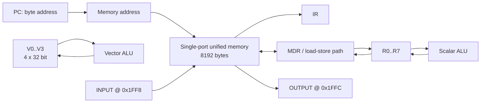

# Лабораторная работа №4. Эксперимент

> ФИО: Павлов Руслан  
> Группа: Р3222  
> Вариант: `asm | risc | neum | hw | tick | binary | trap | mem | pstr | prob2 | vector`

## 1. Краткая характеристика варианта

| Часть варианта | Реализация |
|---|---|
| `asm` | Двухпроходный ассемблер: метки, `.text` / `.data`, `.org`, `.word`, `.string`, `.entry`, `.equ`, `.macro`, `.if/.else/.endif`. |
| `risc` | Все инструкции имеют длину 32 бита; арифметика выполняется над регистрами; память обслуживают `LW`, `SW`, `VLD`, `VST`. |
| `neum` | Единая однопортовая память команд и данных, **байтовая адресация**. |
| `hw` / `tick` | Hardwired Control Unit как FSM; выполнение наблюдаемо по тактам. |
| `binary` | Настоящий `.bin` и текстовый листинг `.lst`. |
| `trap` / `mem` | Ввод вызывает внутреннее прерывание; ввод-вывод доступен через memory-mapped адреса командами `LW`/`SW`. |
| `pstr` | Строка хранится как `[length, char0, char1, ...]`; каждый элемент — 32-битное слово с байтовым адресом. |
| `prob2` | Euler Problem 6; `N` подаётся через входное расписание IRQ. |
| `vector` | Векторные регистры и команды, сравнение scalar/vector на одном входе. |

## 2. Язык программирования: ASM

### 2.1. Синтаксис

```bnf
program       ::= { line }
line          ::= [ label ":" ] [ instruction | directive | macro_call ] [ comment ]
comment       ::= ";" { character }
label         ::= identifier

directive     ::= ".text" | ".data"
                | ".org" value
                | ".entry" identifier
                | ".word" value { "," value }
                | ".string" string_literal
                | ".equ" identifier value
                | ".macro" identifier { identifier } { line } ".endm"
                | ".if" value { line } [ ".else" { line } ] ".endif"

instruction   ::= opcode [ operand { "," operand } ]
operand       ::= register | vector_register | value | offset "(" register ")"
register      ::= "R0" | "R1" | ... | "R7"
vector_register ::= "V0" | "V1" | "V2" | "V3"
value         ::= integer | identifier | character_literal
```

Минимальная условная компиляция поддерживает `.if NAME`, `.if 0`, `.if 1` и отрицание `.if !NAME`, где `NAME` ранее задан через `.equ`. Макросы раскрываются текстовой подстановкой параметров; рекурсивные макросы намеренно не поддерживаются.

Пример демонстрации препроцессора находится в [`examples/bigconst.asm`](examples/bigconst.asm).

### 2.2. Семантика

Язык императивный и последовательно исполняемый: `PC` содержит **байтовый** адрес текущей инструкции, команда выбирается из единой памяти, после выборки обычной инструкции `PC` увеличивается на `4`. Все доступные программисту скалярные данные — 32-битные целые в дополнительном коде. `R0` всегда равен нулю; `R1..R7` используются для вычислений и адресов.

Метки и `.equ` находятся в глобальной области видимости файла. Метка обозначает байтовый адрес слова. Процедура — метка, вызываемая командой `JAL`; адрес возврата хранится в указанном регистре и используется командой `JR`.

Литерал, помещающийся в immediate-поле, кодируется в инструкции. Большой литерал для `LI` разворачивается транслятором в `LUI` + `ORI`. Статические данные и строки размещаются в секции `.data` директивами `.word` и `.string`.

## 3. Организация памяти

### 3.1. Память и адреса

Память фон Неймана единая, однопортовая и байтово-адресуемая. Размер — `8192` байта. Машинное слово и инструкция имеют размер `32` бита (`4` байта); все обращения `LW`, `SW`, `VLD`, `VST` должны быть выровнены на границу 4 байт.

| Байтовый адрес | Назначение |
|---:|---|
| `0x0000` (`0`) | 32-битный вектор прерывания: адрес обработчика `trap`. |
| `0x0004` (`4`) и далее | Код программы по умолчанию. |
| Определяется `.org` | Статические данные, строки, буферы. |
| `0x1FF8` (`8184`) | `IO_INPUT_ADDR`: входной регистр устройства. |
| `0x1FFC` (`8188`) | `IO_OUTPUT_ADDR`: выходной регистр устройства. |

Pascal-строка `s: .string "Hi"`, размещённая по адресу `100`, выглядит так:

| Адрес | Слово | Смысл |
|---:|---:|---|
| `100` | `2` | длина строки |
| `104` | `72` | `'H'` |
| `108` | `105` | `'i'` |

Один символ занимает одно машинное слово, но адреса остаются байтовыми, поэтому шаг указателя равен `4`.

### 3.2. Размещение объектов

- **Инструкции** занимают по одному слову и размещаются с шагом 4 байта.
- **Литералы** immediate не занимают отдельной памяти; `.word` создаёт слово в статических данных.
- **Строки** `.string` находятся в `.data` в формате `pstr`.
- **Переменные и буферы** создаются через `.word`; динамического стека в данной минимальной ISA нет.
- **Процедуры** — участки кода с метками; возвращаются через регистр связи.
- **Прерывание** использует адрес обработчика из слова по адресу `0`; процессор сохраняет `PC` и флаги во внутренних регистрах `SAVED_PC`, `SAVED_FLAGS`.

## 4. Система команд

### 4.1. Форматы машинных инструкций

Все инструкции имеют фиксированный размер 32 бита. Старшие три бита байта opcode кодируют формат, поэтому hardwired-дешифратор определяет формат операцией `opcode >> 5`.

| Формат | Представление |
|---|---|
| `R` | `[opcode:8 | rd:4 | rs1:4 | rs2:4 | unused:12]` |
| `I` | `[opcode:8 | rd:4 | rs1:4 | imm:16]` |
| `J` | `[opcode:8 | rd:4 | imm:20]` |
| `V` | `[opcode:8 | vd:4 | vs1:4 | vs2:4 | unused:12]` |
| `M` | `[opcode:8 | vd:4 | rs1:4 | imm:16]` |
| `S` | `[opcode:8 | unused:24]` |

В переходах `BEQ/BNE/BLT/BGT/BLE/BGE` смещение относительно уже увеличенного `PC` задаётся **в байтах**. `JMP` и `JAL` используют абсолютный байтовый адрес.

### 4.2. Набор команд и число тактов

| Группа | Команды | Назначение | Такты |
|---|---|---|---:|
| Скалярная ALU | `ADD SUB MUL DIV MOD AND OR XOR` | операции только над регистрами | 5 |
| ALU immediate | `ADDI SUBI MULI ANDI ORI LI LUI` | регистр и immediate | 5 |
| Память | `LW` | чтение 32-битного слова / входного порта | 6 |
| Память | `SW` | запись слова / выходного порта | 5 |
| Переходы | `BEQ BNE BLT BGT BLE BGE JMP JR` | изменение потока управления | 4 |
| Вызов | `JAL` | переход с записью адреса возврата | 5 |
| Vector ALU | `VADD VSUB VMUL VDIV VCMP VRED VBC` | операции с четырьмя элементами | 5 |
| Vector memory | `VLD VST` | четыре последовательных обращения к однопортовой памяти | 8 |
| Управление | `EI DI IRET` | режим прерываний | 4 |
| Остановка | `HLT` | остановка модели | 3 |

## 5. Транслятор и бинарное представление

Транслятор реализован в [`src/translator.py`](src/translator.py) и выполняет этапы:

1. удаление комментариев и разбор строк;
2. обработка `.equ`, `.if/.else/.endif` и раскрытие `.macro`;
3. раскрытие псевдоинструкции `LI` для больших констант;
4. первый проход: разрешение меток и размещение объектов по байтовым адресам;
5. второй проход: кодирование инструкций и данных;
6. сохранение бинарного образа и отладочного листинга.

Формат `.bin` является бинарным, а не текстом из нулей и единиц:

```text
<u32 entry_point>
{ <u32 byte_address> <u32 word> }
```

Все числа записываются little-endian. Такой формат сохраняет разрежённую единую память, создаваемую `.org`, и явно содержит байтовые адреса каждого 32-битного слова. Листинг `.lst` имеет вид:

```text
<address> - <HEXCODE> - <mnemonic> - <source>
```

## 6. Модель процессора

Модель находится в [`src/machine.py`](src/machine.py). Она содержит тракт данных `DataPath` и hardwired-устройство управления в виде конечного автомата стадий:



```mermaid
flowchart LR
    FETCH --> DECODE --> EXECUTE
    EXECUTE --> MEMORY --> WRITEBACK --> CHECK_IRQ --> FETCH
    EXECUTE --> WRITEBACK
    EXECUTE --> CHECK_IRQ
    EXECUTE --> HALTED
    CHECK_IRQ -->|IRQ & IE & !IN_HANDLER| IRQENTRY[Save PC/FLAGS<br/>PC := MEM32[0]] --> FETCH
    EXECUTE -->|IRET| IRET[Restore PC/FLAGS] --> CHECK_IRQ
```

Состояние процессора можно наблюдать на каждом такте в журнале: он содержит `tick`, `PC`, стадию, выполняемую инструкцию и отметку `*` во время обработки прерывания.

### 6.1. `trap` и memory-mapped I/O

Вход задаётся расписанием JSON, например:

```json
[[30, "6"], [160, "4"], [290, "\n"]]
```

В указанный такт символ попадает в аппаратный входной регистр по адресу `8184`, а процессор получает IRQ. Обработчик написан на ASM и сам выполняет `LW` из порта. Вывод осуществляется `SW` по адресу `8188`.

Входной порт **не является магической очередью**: это один регистр данных. Если новый символ приходит до чтения предыдущего, он теряется, а журнал содержит `INPUT OVERRUN`. Эта ситуация отдельно демонстрируется программой [`examples/trap_overrun.asm`](examples/trap_overrun.asm) и тестом `test_trap_has_one_word_port_without_hidden_queue`.

## 7. Программы и golden-тесты

| Программа | Исходник | Назначение | Ввод |
|---|---|---|---|
| `hello` | [`examples/hello.asm`](examples/hello.asm) | статическая `pstr` и вывод | — |
| `cat` | [`examples/cat.asm`](examples/cat.asm) | echo через `trap` | [`cat_input.json`](examples/cat_input.json) |
| `hello_user_name` | [`examples/hello_user_name.asm`](examples/hello_user_name.asm) | ввод имени в `pstr` | [`hello_user_name_input.json`](examples/hello_user_name_input.json) |
| `sort` | [`examples/sort.asm`](examples/sort.asm) | сортировка введённых цифр | [`sort_input.json`](examples/sort_input.json) |
| `double_precision` | [`examples/double_precision.asm`](examples/double_precision.asm) | 64-битное сложение двух пар слов с вычислением переноса | — |
| `prob6_scalar` | [`examples/prob6_scalar.asm`](examples/prob6_scalar.asm) | Euler Problem 6, scalar | [`prob6_input.json`](examples/prob6_input.json) |
| `prob6_vector` | [`examples/prob6_vector.asm`](examples/prob6_vector.asm) | Euler Problem 6, vector | [`prob6_input.json`](examples/prob6_input.json) |
| `bigconst` | [`examples/bigconst.asm`](examples/bigconst.asm) | `.equ`, `.macro`, `.if` | — |
| `vector_ops` | [`examples/vector_ops.asm`](examples/vector_ops.asm) | `VADD`, `VSUB`, `VMUL`, `VDIV`, `VCMP`, `VLD`, `VST` | — |
| `trap_overrun` | [`examples/trap_overrun.asm`](examples/trap_overrun.asm) | переполнение однословного input-порта | [`trap_overrun_input.json`](examples/trap_overrun_input.json) |

[`tests/test_golden.py`](tests/test_golden.py) проверяет полную цепочку: ASM переводится в бинарный файл, затем модель исполняет именно загруженный бинарный образ. Для каждой программы в [`tests/golden`](tests/golden) находятся:

- `.bin` — бинарный машинный код и данные;
- `.lst` — человекочитаемый листинг;
- `.out` — ожидаемый вывод;
- `.log` — репрезентативная выдержка тактового журнала;
- `.meta.json` — количество тактов, инструкций и переполнений входного порта.

Дополнительно тестируются байтовые адреса `pstr`, выравнивание `.org`, условная компиляция, round-trip бинарного формата, переполнение однословного input-порта и ошибка при достижении лимита тактов.

## 8. Алгоритм `prob2` и эффективность `vector`

Обе реализации получают один и тот же `N = 64` через расписание `trap` в [`examples/prob6_input.json`](examples/prob6_input.json) и выводят результат Euler Problem 6:

```text
4236960
```

| Реализация | Такты | Инструкции |
|---|---:|---:|
| Scalar | 2718 | 584 |
| Vector | 1576 | 336 |

Ускорение по тактам:

```text
2718 / 1576 = 1.72x
```

Векторная версия строит значения четырёх последовательных чисел в `V1`, параллельно накапливает сумму и сумму квадратов через `VADD`/`VMUL`, затем выполняет `VRED`. Для `N`, не кратного четырём, оставшиеся элементы досчитываются скалярным хвостом.

## 9. Запуск

```bash
python -m venv .venv
# Linux/macOS: source .venv/bin/activate
# Windows PowerShell: .\.venv\Scripts\Activate.ps1
pip install -e ".[dev]"

mkdir build
python src/translator.py examples/hello.asm build/hello.bin --listing build/hello.lst
python src/machine.py build/hello.bin --log build/hello.log

python src/translator.py examples/prob6_vector.asm build/prob6_vector.bin --listing build/prob6_vector.lst
python src/machine.py build/prob6_vector.bin examples/prob6_input.json --log build/prob6_vector.log

pytest -v
ruff check src tests
ruff format --check src tests
mypy src
```

Для осознанного обновления эталонов после изменения ISA или программ:

```bash
UPDATE_GOLDEN=1 pytest -q
```

## 10. CI

GitHub Actions запускает установку dev-зависимостей, `ruff check`, `ruff format --check`, `mypy src` и `pytest -v` при push и pull request. Конфигурация находится в [`.github/workflows/ci.yml`](.github/workflows/ci.yml); настройки Python-инструментов — в [`pyproject.toml`](pyproject.toml).
