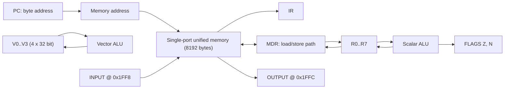
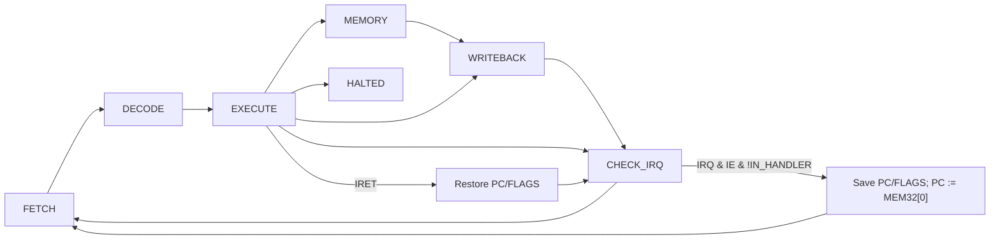

# Лабораторная работа №4. Эксперимент

> ФИО: Павлов Руслан
> Группа: Р3222
>
> Вариант: `asm | risc | neum | hw | tick | binary | trap | mem | pstr | prob2 | vector`

Расшифровка варианта:

| Особенность             | Значение | Реализация                                                        |
|-------------------------|----------|-------------------------------------------------------------------|
| Синтаксис ЯП            | `asm`    | Ассемблер: метки, секции `.text`/`.data`, `.org`, макросы, `.if`. |
| Архитектура             | `risc`   | Фиксированная длина команд 32 бита, регистр-регистровая арифметика.|
| Организация памяти      | `neum`   | Единая память команд и данных, байтовая адресация.                |
| Control Unit            | `hw`     | Hardwired: УУ — часть аппаратной модели, без микрокода.           |
| Точность модели         | `tick`   | Моделирование с точностью до такта.                               |
| Машинный код            | `binary` | Бинарный файл + текстовый листинг.                                |
| Ввод-вывод              | `trap`   | Через систему прерываний, обработчик пишется на ASM.              |
| Ввод-вывод (ISA)        | `mem`    | Memory-mapped: порты I/O отображены в адреса памяти.              |
| Поддержка строк         | `pstr`   | Pascal-string: первое слово — длина, далее символы.               |
| Алгоритм                | `prob2`  | Euler Problem 6: \|sum(1..N)² − sum(1²..N²)\|.                     |
| Усложнение              | `vector` | Векторные регистры и инструкции, сравнение scalar/vector.         |

## Содержание

- [Язык программирования](#язык-программирования)
- [Организация памяти](#организация-памяти)
- [Система команд (ISA)](#система-команд-isa)
- [Транслятор](#транслятор)
- [Модель процессора](#модель-процессора)
- [Тестирование](#тестирование)
- [Усложнение `vector`: сравнение производительности](#усложнение-vector-сравнение-производительности)
- [Структура репозитория и запуск](#структура-репозитория-и-запуск)
- [CI](#ci)
- [Известные ограничения](#известные-ограничения)

---

## Язык программирования

Вариант — `asm`, поэтому язык представляет собой ассемблер реализованной RISC-ISA.
Поддерживаются метки, секции `.text`/`.data`, директивы `.org`, `.entry`, размещение
данных через `.word` и `.string`, константы `.equ`, пользовательские макросы
`.macro`/`.endm` и условная компиляция `.if`/`.else`/`.endif`.

### Синтаксис (форма Бэкуса–Наура)

```ebnf
program        = { line } ;
line           = [ label ] ( instruction | directive | macro_call ) [ comment ]
               | label
               | directive
               | comment ;

label          = identifier ":" ;
identifier     = (letter | "_") { letter | digit | "_" } ;
comment        = ";" { any_char_except_newline } ;

directive      = section_dir | org_dir | entry_dir | word_dir | string_dir
               | equ_dir | macro_def | if_block ;
section_dir    = ".text" | ".data" ;
org_dir        = ".org" integer ;
entry_dir      = ".entry" identifier ;
word_dir       = ".word" value { "," value } ;
string_dir     = ".string" '"' { string_char } '"' ;
string_char    = ? любой символ кроме '"' ? | escape ;
escape         = "\n" | "\t" | "\0" | "\\" | '\"' ;
equ_dir        = ".equ" identifier value ;
macro_def      = ".macro" identifier { identifier } { line } ".endm" ;
if_block       = ".if" value { line } [ ".else" { line } ] ".endif" ;
macro_call     = identifier { operand } ;

instruction    = opcode { operand "," } operand
               | opcode ;                       (* S-тип: HLT, EI, DI, IRET *)

opcode         = "ADD" | "SUB" | "MUL" | "DIV" | "MOD" | "AND" | "OR" | "XOR"
               | "ADDI"| "SUBI"| "MULI"| "ANDI"| "ORI"
               | "LW"  | "SW"  | "LI"  | "LUI"
               | "BEQ" | "BNE" | "BLT" | "BGT" | "BLE" | "BGE"
               | "JMP" | "JAL" | "JR"
               | "VADD"| "VSUB"| "VMUL"| "VDIV"| "VCMP"| "VRED"
               | "VLD" | "VST" | "VBC"
               | "EI"  | "DI"  | "IRET"| "HLT" ;

operand        = reg | vreg | memref | value ;
reg            = "R" digit ;                     (* R0..R7 *)
vreg           = "V" digit ;                     (* V0..V3 *)
memref         = integer "(" reg ")" ;           (* imm(Rs) *)
value          = integer | identifier | char_lit ;
integer        = ["-"] ( dec_int | hex_int | bin_int ) ;
hex_int        = "0x" hex_digit { hex_digit } ;
bin_int        = "0b" ("0"|"1") { "0"|"1" } ;
char_lit       = "'" ( ? any char ? | escape ) "'" ;
```

### Семантика

Стратегия вычислений — императивная, последовательная. `PC` хранит байтовый адрес
текущей инструкции; после выборки обычной инструкции `PC` увеличивается на `4`.
Поток управления изменяют условные и безусловные переходы, процедурные `JAL`/`JR`.

Области видимости. Метки и `.equ` находятся в едином глобальном пространстве имён
файла; дублирование метки — ошибка трансляции. Формальные параметры макроса
локальны и подставляются текстовой заменой при вызове.

Типизация. Единственный тип данных — 32-битное знаковое целое в дополнительном
коде. Литералы целочисленные: десятичные, шестнадцатеричные (`0x`), двоичные
(`0b`) и символьные (`'A'`). `R0` всегда равен нулю, запись в него игнорируется.

Литералы и константы. Значение, помещающееся в поле `imm`, кодируется
непосредственно в инструкции. Литерал для `LI`, не влезающий в 16 бит,
разворачивается транслятором в пару `LUI`+`ORI`. Константа `.equ` — текстовая
замена, памяти не занимает. Строки и статические массивы размещаются в секции
`.data` директивами `.string` и `.word`.

Процедуры реализованы парой `JAL Rlink, addr` (сохраняет адрес возврата в `Rlink`)
и `JR Rlink`. Аппаратного стека нет; при вложенных вызовах программист сохраняет
`Rlink` сам. По данному варианту глубокая вложенность вызовов не требуется.

Условная компиляция поддерживает `.if NAME`, `.if 0`, `.if 1` и отрицание
`.if !NAME`, где `NAME` ранее задан через `.equ`. Выбирается ровно одна ветка на
этапе сборки. Пример вместе с макросами и константами — в
[`examples/bigconst.asm`](examples/bigconst.asm).

### Выполнение программы «на бумаге»

Фрагмент `hello.asm` (строка `msg` размещена директивой `.org 1024`):

```asm
LI   R1, msg        ; R1 <- адрес метки msg (= 1024 по таблице меток)
LW   R2, 0(R1)      ; R2 <- MEM[R1 + 0] = первое слово строки = длина (14)
ADDI R3, R1, 4      ; R3 <- R1 + 4 — адрес первого символа
```

- `LI R1, msg`: поле `imm` берётся из разрешённого адреса метки `msg = 1024`,
  записывается в `R1`.
- `LW R2, 0(R1)`: эффективный адрес `= R1 + 0 = 1024`, читается `MEM[1024]` —
  длина строки по правилам `pstr`, равная `14`.
- `ADDI R3, R1, 4`: `R3 = 1024 + 4 = 1028` — адрес первого символа, так как при
  байтовой адресации шаг между словами равен `4`.

---

## Организация памяти

Память фон Неймана: инструкции и данные находятся в одной однопортовой
байтово-адресуемой памяти размером `8192` байта. Машинное слово и инструкция
занимают `32` бита (`4` байта); все обращения `LW`, `SW`, `VLD`, `VST` выровнены
на границу 4 байт.

### Карта памяти

| Байтовый адрес        | Назначение                                            |
|----------------------:|-------------------------------------------------------|
| `0x0000` (`0`)        | Вектор прерывания: слово содержит адрес обработчика.  |
| `0x0004` (`4`)        | Точка входа программы по умолчанию (`.text`).         |
| Задаётся `.org`       | Статические данные, строки `pstr`, буферы (`.data`).  |
| `0x1FF8` (`8184`)     | `IO_INPUT_ADDR` — входной регистр устройства ввода.   |
| `0x1FFC` (`8188`)     | `IO_OUTPUT_ADDR` — выходной регистр устройства вывода.|

Pascal-строка `.string "Hi"`, размещённая по адресу `100`:

| Адрес  | Слово | Смысл       |
|-------:|------:|-------------|
| `100`  | `2`   | длина строки |
| `104`  | `72`  | `'H'`        |
| `108`  | `105` | `'i'`        |

Один символ занимает одно машинное слово; адреса байтовые, поэтому шаг указателя
по строке равен `4`.

### Регистры

```text
Скалярные регистры (8 × 32 бита)
    R0          — всегда 0 (hardwired), запись игнорируется
    R1 … R7     — общего назначения

Векторные регистры (4 × 4 элемента × 32 бита)
    V0 … V3

Управляющие регистры
    PC          — программный счётчик (байтовый адрес)
    IR          — регистр текущей инструкции
    FLAGS       — биты Z (zero) и N (negative)
    IE          — interrupt enable (1 бит)
    IN_HANDLER  — признак нахождения в обработчике (1 бит)
    SAVED_PC    — сохранённый PC при входе в прерывание
    SAVED_FLAGS — сохранённые FLAGS
```

### Размещение объектов

- Литералы в инструкциях кодируются полем `imm` (непосредственная адресация).
  Большие литералы для `LI` разворачиваются в `LUI`+`ORI`; альтернатива —
  хранить значение в `.word` и читать `LW`.
- Литералы из нескольких слов (строки) хранятся в `.data` в формате `pstr`:
  первое слово — длина, далее по одному коду символа на слово. Адрес метки строки
  указывает на слово длины.
- Переменные размещаются прежде всего на регистрах `R1..R7`; при их нехватке
  значение выгружается в память (`SW`) и подгружается обратно (`LW`).
- Инструкции занимают по одному слову и размещаются с шагом 4 байта, начиная с
  адреса, заданного `.org`.
- Процедуры — участки кода с метками, вызов `JAL`, возврат `JR`.
- Прерывания используют адрес обработчика из слова по адресу `0`; при входе
  процессор сохраняет `PC` и `FLAGS` в `SAVED_PC`/`SAVED_FLAGS`.

---

## Система команд (ISA)

Классификация: RISC (фиксированная длина 32 бита, load/store-архитектура,
арифметика только над регистрами), без выделенного аккумулятора,
фон-Неймановская память.

### Машинное слово и кодирование

Все инструкции — ровно одно 32-битное слово. Опкод занимает старший байт
(биты 31..24): старшие 3 бита задают тип (формат), младшие 5 — номер операции
внутри типа.

```text
opcode (8 бит):
+-----------+------------------+
|  7  6  5  |  4  3  2  1  0   |
|   тип     |  номер операции  |
+-----------+------------------+

тип:  000=R   001=I   010=J   011=V   100=M   101=S
```

Формат инструкции определяется одной битовой операцией `opcode >> 5`. В hardwired
control unit три старших провода опкода идут прямо на дешифратор формата, без ПЗУ:

```python
def opcode_type(op: int) -> InstrType:
    return InstrType((op >> 5) & 0b111)
```

### Форматы инструкций

| Формат | Представление                                          |
|--------|--------------------------------------------------------|
| `R`    | `[opcode:8 \| rd:4 \| rs1:4 \| rs2:4 \| unused:12]`     |
| `I`    | `[opcode:8 \| rd:4 \| rs1:4 \| imm:16 знаковый]`        |
| `J`    | `[opcode:8 \| rd:4 \| imm:20 знаковый]`                 |
| `V`    | `[opcode:8 \| vd:4 \| vs1:4 \| vs2:4 \| unused:12]`     |
| `M`    | `[opcode:8 \| vd:4 \| rs1:4 \| imm:16 знаковый]`        |
| `S`    | `[opcode:8 \| unused:24]`                               |

Поля `rd / rs1 / rs2 / imm` занимают одни и те же битовые позиции у всех типов,
поэтому регистровый файл и АЛУ выбирают операнды по фиксированным проводам, а
формат определяет, какие поля активны.

### Таблица опкодов

| Инструкции                          | Hex          | Тип |
|-------------------------------------|--------------|-----|
| `ADD SUB MUL DIV MOD AND OR XOR`    | `0x00`–`0x07`| R   |
| `ADDI SUBI MULI ANDI ORI`           | `0x20`–`0x24`| I   |
| `LW SW LI LUI`                      | `0x25`–`0x28`| I   |
| `BEQ BNE BLT BGT BLE BGE`           | `0x29`–`0x2E`| I   |
| `JMP JAL JR`                        | `0x40`–`0x42`| J   |
| `VADD VSUB VMUL VDIV VCMP VRED`     | `0x60`–`0x65`| V   |
| `VLD VST VBC`                       | `0x80`–`0x82`| M   |
| `EI DI IRET HLT`                    | `0xA0`–`0xA3`| S   |

### Набор инструкций и число тактов

| Инструкция            | Hex | Тип | Семантика                          | Тактов* |
|-----------------------|----:|-----|------------------------------------|--------:|
| `ADD Rd, Rs1, Rs2`    | `00`| R   | Rd ← Rs1 + Rs2                      | 5 |
| `SUB Rd, Rs1, Rs2`    | `01`| R   | Rd ← Rs1 − Rs2                      | 5 |
| `MUL Rd, Rs1, Rs2`    | `02`| R   | Rd ← Rs1 · Rs2                      | 5 |
| `DIV Rd, Rs1, Rs2`    | `03`| R   | Rd ← Rs1 / Rs2                      | 5 |
| `MOD Rd, Rs1, Rs2`    | `04`| R   | Rd ← Rs1 mod Rs2                    | 5 |
| `AND/OR/XOR`          | `05`–`07`| R | побитовые                       | 5 |
| `ADDI/SUBI/MULI`      | `20`–`22`| I | арифметика с imm16              | 5 |
| `ANDI/ORI`            | `23`–`24`| I | побитовые с imm                 | 5 |
| `LW  Rd, imm(Rs)`     | `25`| I   | Rd ← MEM[Rs+imm]                    | 6 |
| `SW  Rd, imm(Rs)`     | `26`| I   | MEM[Rs+imm] ← Rd                    | 5 |
| `LI  Rd, imm16`       | `27`| I   | Rd ← imm                            | 5 |
| `LUI Rd, imm16`       | `28`| I   | Rd ← imm << 16                      | 5 |
| `BEQ/BNE/BLT/…`       | `29`–`2E`| I | PC ← PC + imm, если условие     | 4 |
| `JMP imm20`           | `40`| J   | PC ← imm                            | 4 |
| `JAL Rd, imm20`       | `41`| J   | Rd ← PC; PC ← imm                   | 5 |
| `JR  Rd`              | `42`| J   | PC ← Rd                             | 4 |
| `VADD Vd, Vs1, Vs2`   | `60`| V   | Vd[i] ← Vs1[i] + Vs2[i]             | 5 |
| `VSUB/VMUL/VDIV`      | `61`–`63`| V | поэлементно                     | 5 |
| `VCMP Vd, Vs1, Vs2`   | `64`| V   | Vd[i] ← (Vs1[i] == Vs2[i]) ? 1 : 0  | 5 |
| `VRED Rd, Vs1`        | `65`| V   | Rd ← Σ Vs1[i]                       | 5 |
| `VLD Vd, imm(Rs)`     | `80`| M   | Vd ← MEM[Rs+imm .. +VLEN]           | 8 |
| `VST Vd, imm(Rs)`     | `81`| M   | MEM[Rs+imm ..] ← Vd                 | 8 |
| `VBC Vd, Rs1`         | `82`| M   | Vd[i] ← Rs1 (broadcast)             | 5 |
| `EI / DI`             | `A0`/`A1`| S | разрешить/запретить прерывания  | 4 |
| `IRET`                | `A2`| S   | возврат из обработчика              | 4 |
| `HLT`                 | `A3`| S   | остановить процессор                | 3 |

\* Число тактов = число активных стадий FSM плюс стадия `CHECK_IRQ` между
инструкциями. `VLD`/`VST` тратят `VECTOR_LEN = 4` такта в стадии MEMORY, так как
однопортовая память передаёт одно слово за такт.

### Адресация

- Регистровая прямая — операнды R- и V-типа.
- Регистр + смещение — для `LW/SW/VLD/VST`, эффективный адрес `= Rs + imm`.
- Непосредственная (immediate) — для I- и J-типа.
- Относительная (PC-relative) — для условных переходов: смещение задаётся в
  байтах относительно уже увеличенного `PC`.
- Memory-mapped I/O — обращение по адресам `8184`/`8188` эквивалентно
  чтению/записи портов ввода/вывода (вариант `mem`).

### Поток управления и прерывания

Между инструкциями (после WRITEBACK) процессор проходит стадию `CHECK_IRQ`.
Если есть запрос прерывания, `IE = 1` и `IN_HANDLER = 0`, аппаратура выполняет:

1. `SAVED_PC ← PC`, `SAVED_FLAGS ← FLAGS`;
2. `IN_HANDLER ← 1`;
3. `PC ← MEM[0]` (адрес обработчика);
4. обычное исполнение обработчика до команды `IRET`.

`IRET` восстанавливает `PC ← SAVED_PC`, `FLAGS ← SAVED_FLAGS`, `IN_HANDLER ← 0`.

Вложенные прерывания. Пока `IN_HANDLER = 1`, новый запрос на стадии `CHECK_IRQ`
не вытесняет текущий обработчик: в журнале появляется строка
`CHECK_IRQ: запрос есть, но IH=1 (nested) — откладываем`, и запрос обрабатывается
после `IRET`. Это и есть проработка ситуации «прерывание во время прерывания».

Получение данных отделено от вызова прерывания (см. раздел
[`trap`](#trap-и-memory-mapped-io)): задержка обработчика влияет на то, успеет ли
программа прочитать символ до прихода следующего, но самой очереди символов нет.

---

## Транслятор

Реализован в [`src/translator.py`](src/translator.py) как двухпроходный консольный
ассемблер.

### Интерфейс командной строки

```bash
python src/translator.py <source.asm> <output.bin> [--listing <output.lst>]
```

- `source.asm` — входной файл с программой;
- `output.bin` — бинарный машинный код;
- `--listing` — текстовый листинг для отладки (опционально).

### Этапы работы

1. Лексер: построчное чтение, удаление комментариев (`;` до конца строки, кроме
   случая внутри `.string "..."`), отбрасывание пустых строк.
2. Препроцессор: раскрытие `.equ` (замена по токену), `.if`/`.else`/`.endif`
   (выбор одной ветки) и пользовательских макросов (подстановка тела с заменой
   параметров). Рекурсивные макросы намеренно не поддерживаются.
3. Раскрытие псевдоинструкции `LI` для констант, не помещающихся в 16 бит.
4. Первый проход: вычисление байтового адреса каждой строки (инструкция — 4 байта,
   `.word a,b,c` — `4·n` байт, `.string "abc"` — `4·(1+len)` байт), заполнение
   таблицы меток; `.org N` устанавливает текущий адрес.
5. Второй проход: кодирование инструкций и данных, разрешение ссылок на метки.
   Для условных переходов смещение считается относительно следующего `PC` в байтах.
6. Сериализация бинарного образа и листинга.

### Бинарный формат

```text
<u32 entry_point>
{ <u32 byte_address> <u32 word> }
```

Все числа — little-endian. Формат хранит разрежённый образ памяти (с «дырками» от
`.org`) и явно содержит байтовый адрес каждого 32-битного слова, не перечисляя
нулевые ячейки. Это настоящий бинарный файл, а не текст из нулей и единиц.

### Соответствие исходного и машинного кода

| Исходный код        | Машинное слово | Семантика                                |
|---------------------|----------------|------------------------------------------|
| `LI R1, 42`         | `0x2710002A`   | I-тип: opcode=0x27, rd=1, imm=42         |
| `LW R2, 0(R1)`      | `0x25210000`   | I-тип: opcode=0x25, rd=2, rs1=1, imm=0   |
| `ADD R3, R1, R2`    | `0x00312000`   | R-тип: opcode=0x00, rd=3, rs1=1, rs2=2   |
| `JMP label`         | `0x400xxxxx`   | J-тип: imm = байтовый адрес label        |
| `BEQ R1, R2, label` | `0x2912xxxx`   | I-тип: imm = label − (PC+4) в байтах     |
| `VLD V0, 0(R6)`     | `0x80060000`   | M-тип: opcode=0x80, vd=0, rs1=6          |
| `.string "Hi"`      | `0x02 0x48 0x49` | pstr: длина + коды символов            |

### Разворот больших констант

Поле `imm` вмещает 16 бит. Если значение в `LI Rd, BIG` не помещается, транслятор
разворачивает псевдоинструкцию в две машинные: `LUI Rd, (BIG >> 16)` и
`ORI Rd, Rd, (BIG & 0xFFFF)`. Пример с макросами, `.equ` и `.if/.else` — в
[`examples/bigconst.asm`](examples/bigconst.asm).

### Пример листинга (`hello.lst`)

```text
; entry point: 4
; address - hex      - mnemonic                 - source
1024 - 0000000E - .string len=14           - .string "Hello, World!\n"
1028 - 00000048 - .string 'H'              - .string "Hello, World!\n"
...
```

Формат строки: `адрес – HEX-код – мнемоника – исходная строка`.

---

## Модель процессора

Реализована в [`src/machine.py`](src/machine.py). Моделирование с точностью до такта.

### Интерфейс командной строки

```bash
python src/machine.py <binary> [<input.json>] [--log <log_path>] [--max-ticks N]
```

- `binary` — бинарный файл от транслятора;
- `input.json` — расписание ввода `[[tick, char], ...]`;
- `--log` — путь для журнала тактов;
- `--max-ticks` — лимит тактов (по умолчанию 200000).

### Схема DataPath



Особенности тракта:

- Регистровый файл — три порта чтения (`rs1`, `rs2`, `rd` для store) и один порт
  записи (WRITEBACK).
- АЛУ объединено: скалярное — один 32-битный блок; векторное — четыре параллельных
  функциональных блока, обрабатывающих все элементы вектора за один такт. В этом и
  состоит выигрыш векторизации.
- Память однопортовая: за такт читается или записывается одно слово, поэтому
  `VLD`/`VST` занимают `VECTOR_LEN = 4` такта в стадии MEMORY.
- Адреса `8184`/`8188` не обычная память: обращение по ним взаимодействует с
  устройствами ввода-вывода (memory-mapped, вариант `mem`).

### Схема Control Unit (hardwired)

Управляющее устройство — конечный автомат стадий. Микрокодного ПЗУ нет, логика
комбинационная (вариант `hw`): следующая стадия выбирается по типу опкода в `IR`.



Стадии: FETCH → DECODE → EXECUTE → (MEMORY) → WRITEBACK → CHECK_IRQ. Каждая стадия
тратит один такт, кроме MEMORY для `VLD`/`VST` (`VECTOR_LEN` тактов). В программной
модели стадии реализованы методами `_stage_fetch`, `_stage_decode`,
`_stage_execute`, `_stage_memory`, `_stage_writeback`, `_stage_check_irq`.

### Флаги

- `Z` (zero) — результат АЛУ равен 0;
- `N` (negative) — результат АЛУ меньше 0;
- `IE`, `IN_HANDLER` — управление прерываниями (см. выше).

### Журнал работы

Каждая строка содержит номер такта, текущий `PC`, стадию, выполняемую инструкцию и
отметку `*` при нахождении в обработчике прерывания. Начало `hello.log`:

```text
[tick=    0] [PC=   4] [stage=FETCH    ]   FETCH word=0x27100400 (LI R1, 1024)
[tick=    1] [PC=   8] [stage=DECODE   ]   DECODE LI R1, 1024
[tick=    2] [PC=   8] [stage=EXECUTE  ]   EXECUTE LI R1, 1024
[tick=    3] [PC=   8] [stage=WRITEBACK]   WRITEBACK R1 <- 1024
[tick=    5] [PC=   8] [stage=FETCH    ]   FETCH word=0x25210000 (LW R2, 0(R1))
[tick=    6] [PC=  12] [stage=DECODE   ]   DECODE LW R2, 0(R1)
[tick=    7] [PC=  12] [stage=EXECUTE  ]   EXECUTE LW R2, 0(R1)
[tick=    8] [PC=  12] [stage=MEMORY   ]   MEMORY LW addr=1024 -> 14
[tick=    9] [PC=  12] [stage=WRITEBACK]   WRITEBACK R2 <- 14
```

`LI` исполняется за 5 тактов (FETCH→DECODE→EXECUTE→WRITEBACK + CHECK_IRQ), `LW` —
за 6 (добавляется MEMORY). На стадии MEMORY видно чтение длины строки `pstr`
(`addr=1024 -> 14`). Пропуск номера такта (3 → 5) — это потраченный такт CHECK_IRQ.

### `trap` и memory-mapped I/O

Вход задаётся расписанием JSON, например:

```json
[[30, "6"], [160, "4"], [290, "\n"]]
```

В указанный такт символ попадает в аппаратный входной регистр по адресу `8184`, и
процессор получает IRQ. Обработчик написан на ASM и сам выполняет `LW` из порта;
вывод выполняется командой `SW` по адресу `8188`. Фрагмент `cat.log` показывает
вход в обработчик (адрес `12`), чтение порта и откладывание вложенного запроса:

```text
[tick=   30] [PC=  12] [stage=EXECUTE  ]   IRQ: появился символ 'E' (код 69)
[tick=   31] [PC=   8] [stage=CHECK_IRQ] * CHECK_IRQ: запрос есть, IE=1, IH=0 -> переход в обработчик по адресу 12 (saved_pc=8)
[tick=   32] [PC=  12] [stage=FETCH    ] * FETCH word=0x27101FF8 (LI R1, 8184)
[tick=   36] [PC=  16] [stage=CHECK_IRQ] * CHECK_IRQ: запрос есть, но IH=1 (nested) — откладываем
```

Входной порт — один регистр данных, а не очередь. Если новый символ приходит до
чтения предыдущего, он теряется, и в журнал пишется `INPUT OVERRUN`:

```text
[tick=   30] [PC=  12] [stage=EXECUTE  ]   INPUT OVERRUN: символ 'X' потерян; регистр ввода занят
```

Ситуация воспроизводится программой [`examples/trap_overrun.asm`](examples/trap_overrun.asm)
и тестом `test_trap_has_one_word_port_without_hidden_queue`.

---

## Тестирование

Все интеграционные тесты — golden-тесты в [`tests/test_golden.py`](tests/test_golden.py):
ASM транслируется в бинарный файл, модель исполняет именно загруженный бинарный
образ, вывод и метрики сравниваются с эталонами в [`tests/golden`](tests/golden).
Для каждой программы хранятся:

- `.bin` — бинарный машинный код и данные;
- `.lst` — листинг;
- `.out` — ожидаемый вывод;
- `.log` — репрезентативная выдержка тактового журнала;
- `.meta.json` — число тактов, инструкций и переполнений входного порта.

| Программа          | Исходник                                                    | Назначение                                  | Вывод               | Тактов | Инстр. |
|--------------------|-------------------------------------------------------------|---------------------------------------------|---------------------|-------:|-------:|
| `hello`            | [hello.asm](examples/hello.asm)                             | статическая `pstr`, вывод                   | `Hello, World!`     | 439    | 91     |
| `cat`              | [cat.asm](examples/cat.asm)                                 | echo через `trap`                           | `Echo!`             | 592    | 140    |
| `hello_user_name`  | [hello_user_name.asm](examples/hello_user_name.asm)         | ввод имени в `pstr`, приветствие            | `Hello, Alice!`     | 2653   | 598    |
| `sort`             | [sort.asm](examples/sort.asm)                               | сортировка введённых цифр                   | `1234`              | 1271   | 273    |
| `double_precision` | [double_precision.asm](examples/double_precision.asm)       | 64-битное сложение с переносом              | `1:0`               | 129    | 26     |
| `bigconst`         | [bigconst.asm](examples/bigconst.asm)                       | `.equ`, `.macro`, `.if/.else`               | `A`                 | 28     | 6      |
| `vector_ops`       | [vector_ops.asm](examples/vector_ops.asm)                   | `VADD/VSUB/VMUL/VDIV/VCMP/VLD/VST`           | —                   | 97     | 18     |
| `trap_overrun`     | [trap_overrun.asm](examples/trap_overrun.asm)               | переполнение однословного input-порта       | —                   | 46     | 11     |
| `prob6_scalar`     | [prob6_scalar.asm](examples/prob6_scalar.asm)               | Euler Problem 6, скаляр                      | `4236960`           | 2718   | 584    |
| `prob6_vector`     | [prob6_vector.asm](examples/prob6_vector.asm)               | Euler Problem 6, вектор                      | `4236960`           | 1576   | 336    |

Помимо golden-тестов проверяются: байтовые адреса элементов `pstr`, выравнивание
`.org` на границу слова, условная компиляция, round-trip бинарного формата,
переполнение однословного входного порта без скрытой очереди и корректная ошибка
при достижении лимита тактов.

### Пример работы инструментальной цепочки

```bash
python src/translator.py examples/hello.asm build/hello.bin --listing build/hello.lst
python src/machine.py build/hello.bin --log build/hello.log
# OUTPUT:
# Hello, World!
# Тактов исполнено:    439
# Инструкций исполнено: 91
```

Обновление эталонов после намеренного изменения ISA или программ:

```bash
UPDATE_GOLDEN=1 pytest -q
```

---

## Усложнение `vector`: сравнение производительности

Реализованы векторные регистры `V0..V3` (по 4 элемента 32 бита) и векторные
инструкции:

- `VADD / VSUB / VMUL / VDIV / VCMP` — поэлементные операции, один такт АЛУ на все
  4 элемента;
- `VLD / VST` — обмен с памятью, 4 такта (по одному слову на такт, память
  однопортовая);
- `VRED Rd, Vs` — редукция-сумма вектора в скаляр;
- `VBC Vd, Rs` — broadcast скаляра в вектор.

### Постановка (Euler Problem 6)

Дано `N`. Найти `S = |sum(1..N)² − sum(1²..N²)|`. В экспериментах `N = 64`
подаётся обеим реализациям через расписание `trap`
([`examples/prob6_input.json`](examples/prob6_input.json)); правильный ответ —
`4236960`. Обе реализации дают этот результат, что подтверждает корректность.

### Результаты

| Метрика     | Скаляр (N=64) | Вектор (N=64) | Ускорение |
|-------------|--------------:|--------------:|----------:|
| Тактов      | 2718          | 1576          | 1.72×     |
| Инструкций  | 584           | 336           | 1.74×     |
| Ответ       | 4236960       | 4236960       | —         |

Векторная версия строит четыре последовательных числа, накапливает сумму и сумму
квадратов через `VADD`/`VMUL`, затем сворачивает аккумуляторы командой `VRED`.
Остаток `N`, не кратный четырём, досчитывается скалярным хвостом. Ускорение меньше
теоретического 4× из-за стоимости `VLD`/`VST` (4 такта на блок) и сохранения
скалярных операций управления циклом, редукции и финального
`sum² − sum_sq`. На теле цикла векторизация даёт ожидаемый SIMD-эффект; тест
`test_vector_beats_scalar` требует ускорения не менее 1.5×.

### Что видно в журнале

Векторная стадия EXECUTE обрабатывает весь вектор за один такт АЛУ, а стадия
MEMORY для `VLD` — четыре отдельных такта чтения (`vector_ops.log`):

```text
[tick=    8] [PC=  12] [stage=MEMORY   ]   MEMORY VLD[0] addr=1024 -> V0[0]=8
[tick=    9] [PC=  12] [stage=MEMORY   ]   MEMORY VLD[1] addr=1028 -> V0[1]=12
[tick=   10] [PC=  12] [stage=MEMORY   ]   MEMORY VLD[2] addr=1032 -> V0[2]=16
[tick=   11] [PC=  12] [stage=MEMORY   ]   MEMORY VLD[3] addr=1036 -> V0[3]=20
[tick=   28] [PC=  24] [stage=EXECUTE  ]     V0=[8, 12, 16, 20] + V1=[2, 3, 4, 5] -> V2=[10, 15, 20, 25]  (4 элемента за 1 такт ALU!)
```

---

## Структура репозитория и запуск

```text
lab4_csa/
├── README.md                  — отчёт
├── pyproject.toml             — настройки ruff/mypy/pytest
├── .github/workflows/ci.yml   — CI
├── src/
│   ├── isa.py                 — определение системы команд
│   ├── translator.py          — двухпроходный ассемблер
│   └── machine.py             — модель процессора (tick)
├── examples/                  — программы на ASM, бинарники, листинги, логи
└── tests/
    ├── test_golden.py         — golden + unit-тесты
    └── golden/                — эталоны
```

```bash
python -m venv .venv
# Linux/macOS: source .venv/bin/activate
# Windows PowerShell: .\.venv\Scripts\Activate.ps1
pip install -e ".[dev]"

mkdir build
python src/translator.py examples/hello.asm build/hello.bin --listing build/hello.lst
python src/machine.py build/hello.bin --log build/hello.log

python src/translator.py examples/prob6_vector.asm build/prob6_vector.bin --listing build/prob6_vector.lst
python src/machine.py build/prob6_vector.bin examples/prob6_input.json --log build/prob6_vector.log

pytest -v
ruff check src tests
ruff format --check src tests
mypy src
```

---

## CI

GitHub Actions ([`.github/workflows/ci.yml`](.github/workflows/ci.yml)) на каждый
push и pull request устанавливает dev-зависимости и запускает:

1. `ruff check src tests` — линтер;
2. `ruff format --check src tests` — проверка форматирования;
3. `mypy src` — статическая типизация;
4. `pytest -v` — все тесты, включая golden и `test_vector_beats_scalar`.

Настройки инструментов — в [`pyproject.toml`](pyproject.toml); `mypy` запущен в
строгом режиме. Из правил `ruff` отключены только: `E501` (длинные сообщения
исключений), `PLR2004` (магические числа в определении ISA), `B008` (глобальный
лог модели) и `RUF001`–`RUF003` (кириллица в комментариях и docstring-ах). Каждое
отключение прокомментировано в конфигурации.

---

## Известные ограничения

1. Аппаратного стека нет: вызовы реализованы через регистр связи (`Rlink`); для
   глубокой рекурсии понадобился бы программный стек.
2. Макропроцессор не поддерживает вложенные и рекурсивные макросы.
3. `MUL`/`DIV` выполняются за один такт; многотактовая модель сделала бы оценку
   производительности точнее.
<<<<<<< HEAD
4. Объём памяти — 8192 байта; расширение сводится к изменению одной константы.
=======
4. Объём памяти — 8192 байта; расширение сводится к изменению одной константы.
>>>>>>> e7ae309 (last readme)
