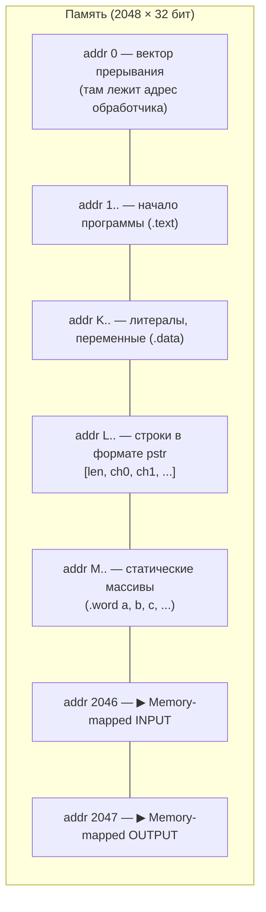
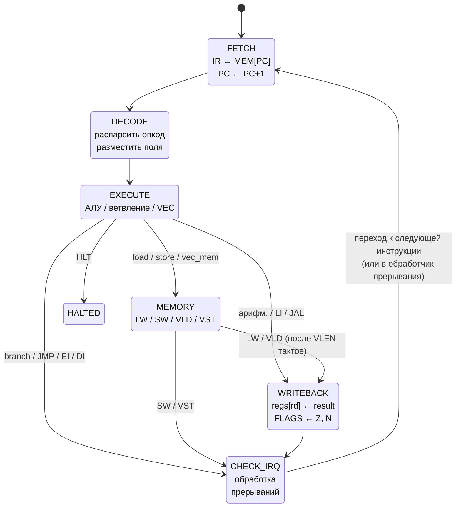
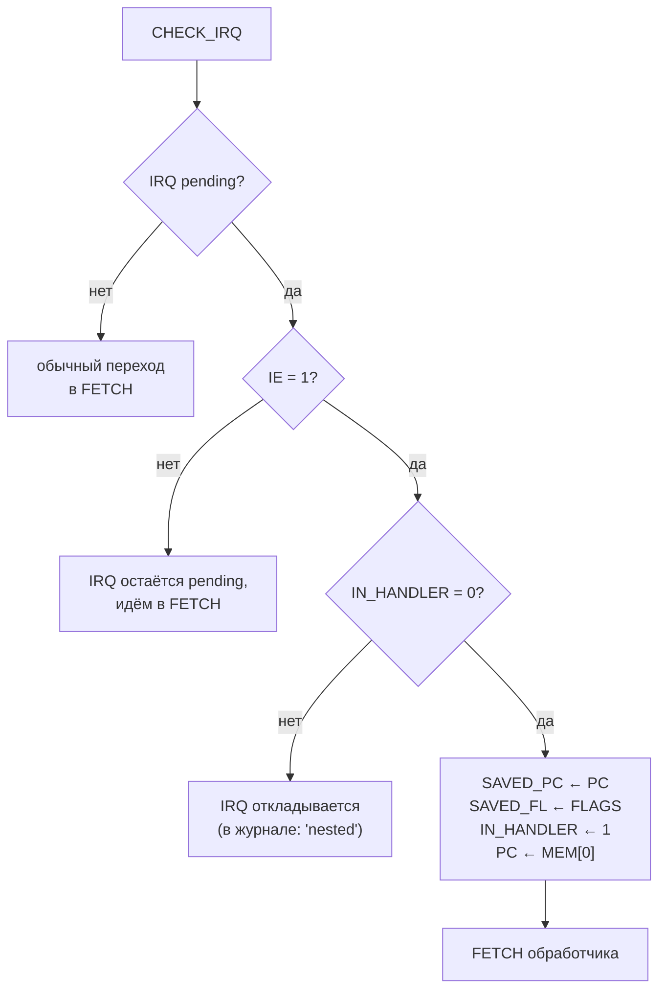

# Лабораторная работа №4. Эксперимент

> **ФИО:** Павлов Руслан
> **Группа:** Р3222
>
> **Вариант:** `asm | risc | neum | hw | tick | binary | trap | mem | pstr | prob2 | vector`

Расшифровка варианта:

| Особенность             | Значение     | Что это значит                                                         |
|-------------------------|--------------|------------------------------------------------------------------------|
| Синтаксис ЯП            | `asm`        | Ассемблер: метки, секции, `.org`, макросы.                             |
| Архитектура             | `risc`       | RISC: фиксированная длина команд, регистр-регистровая арифметика.      |
| Организация памяти      | `neum`       | Фон-Неймановская: одна память для команд и данных.                     |
| Control Unit            | `hw`         | Hardwired: УУ — часть аппаратной модели, без микрокода.                |
| Точность модели         | `tick`       | Моделирование с точностью до такта.                                    |
| Машинный код            | `binary`     | Настоящий бинарный файл + текстовый листинг.                           |
| Ввод-вывод              | `trap`       | Через систему прерываний, обработчик пишется на нашем ASM.             |
| Ввод-вывод (ISA)        | `mem`        | Memory-mapped: порты I/O отображены в адреса памяти.                   |
| Поддержка строк         | `pstr`       | Pascal-string: первое слово — длина, далее — символы.                  |
| Алгоритм                | `prob2`      | Euler Problem 6: \|sum(1..N)² − sum(1²..N²)\|.                         |
| Усложнение              | `vector`     | Векторные регистры и инструкции, демонстрация ускорения.               |

---

## Содержание

- [Язык программирования](#язык-программирования)
- [Организация памяти](#организация-памяти)
- [Система команд (ISA)](#система-команд-isa)
- [Транслятор](#транслятор)
- [Модель процессора](#модель-процессора)
- [Тестирование](#тестирование)
- [Реализация варианта `vector`: сравнение производительности](#реализация-варианта-vector-сравнение-производительности)
- [Структура репозитория и запуск](#структура-репозитория-и-запуск)
- [CI](#ci)

---

## Язык программирования

Вариант — `asm`, поэтому язык представляет собой ассемблер нашей RISC ISA. Он
поддерживает метки, секции `.text` / `.data`, директиву `.org`, размещение
данных через `.word` и `.string`, константы (`.equ`) и макросы.

### Синтаксис в форме Бэкуса–Наура

```ebnf
program        = { line } ;
line           = [ label ] ( instruction | directive | macro_call ) [ comment ]
               | label
               | directive
               | comment ;

label          = identifier ":" ;
identifier     = (letter | "_") { letter | digit | "_" } ;
comment        = ";" { any_char_except_newline } ;

directive      = section_dir | org_dir | word_dir | string_dir
               | equ_dir | macro_def | entry_dir ;
section_dir    = ".text" | ".data" ;
org_dir        = ".org" integer ;
word_dir       = ".word" value { "," value } ;
string_dir    = ".string" '"' { string_char } '"' ;
string_char    = ? любой символ кроме "\"" ? | escape ;
escape         = "\\n" | "\\t" | "\\0" | "\\\\" | '\\"' ;
equ_dir        = ".equ" identifier value ;
entry_dir      = ".entry" identifier ;

macro_def      = ".macro" identifier { identifier } { line } ".endm" ;
macro_call     = identifier { operand } ;

instruction    = opcode { operand "," } operand
               | opcode (* для S-типа: HLT, EI, DI, IRET *) ;

opcode         = "ADD" | "SUB" | "MUL" | "DIV" | "MOD"
               | "AND" | "OR"  | "XOR"
               | "ADDI"| "SUBI"| "MULI"| "ANDI"| "ORI"
               | "LW"  | "SW"  | "LI"  | "LUI"
               | "BEQ" | "BNE" | "BLT" | "BGT" | "BLE" | "BGE"
               | "JMP" | "JAL" | "JR"
               | "VLD" | "VST" | "VADD"| "VSUB"| "VMUL"
               | "VDIV"| "VCMP"| "VRED"| "VBC"
               | "EI"  | "DI"  | "IRET"| "HLT" ;

operand        = reg | vreg | memref | value ;
reg            = "R" digit ;                    (* R0..R7 *)
vreg           = "V" digit ;                    (* V0..V3 *)
memref         = integer "(" reg ")" ;          (* imm(Rs) *)
value          = integer | identifier | char_lit ;

integer        = ["-"] ( dec_int | hex_int | bin_int ) ;
dec_int        = digit { digit } ;
hex_int        = "0x" hex_digit { hex_digit } ;
bin_int        = "0b" ("0"|"1") { "0"|"1" } ;
char_lit       = "'" ( ? any char ? | escape ) "'" ;
```

### Семантика

**Стратегия вычислений.** Императивная, последовательная: процессор выбирает
инструкцию по адресу `PC`, увеличивает `PC`, исполняет инструкцию. Управление
потоком — условные/безусловные переходы и `JAL`/`JR` для процедур.

**Области видимости.** Все идентификаторы (метки, `.equ`) живут в одном
глобальном пространстве имён файла. Дублирование меток — ошибка трансляции.
Макросы имеют локальные формальные параметры, которые подставляются
текстовой заменой.

**Типизация.** Один тип данных — 32-битное знаковое целое. Все литералы —
целочисленные (десятичные, шестнадцатеричные `0x`, двоичные `0b`, символьные
`'A'`).

**Литералы и константы.**
* Литералы в инструкциях кодируются в поле `imm` (16 или 20 бит, знаковое).
* Если значение не помещается в `imm` (например, число > 32767),
  транслятор выдаст ошибку. В этом случае нужно использовать пару
  `LUI`+`ADDI` или загрузить значение из памяти.
* Константы `.equ` — это просто текстовая замена; они не занимают памяти.

**Процедуры.** Реализованы через пару `JAL Rlink, addr` (сохраняет адрес
возврата в `Rlink`) и `JR Rlink` (переход по регистру). Сохранение/
восстановление регистров — забота программиста (стека у нас нет, по варианту
он не нужен, и в пользовательском коде обычно вызовов мало).

**Прерывания.** Реализованы для варианта `trap` — детали в разделе
[Модель процессора](#модель-процессора).

**Программа «на бумаге».** Для примера разберём строку из `hello.asm`:

```asm
LI   R1, msg        ; R1 <- адрес метки msg (по табл. меток = 100)
LW   R2, 0(R1)      ; R2 <- MEM[R1 + 0] = первое слово строки = длина
ADDI R3, R1, 1      ; R3 <- R1 + 1, указатель на первый символ
```

Шаг 1: декодируем `LI R1, msg`. Поле `imm` берётся как разрешённое значение
метки `msg = 100`. Записываем в R1 число 100.
Шаг 2: `LW R2, 0(R1)`. Эффективный адрес = R1 + 0 = 100. Считаем `MEM[100]`,
это — длина строки по правилам `pstr`.
Шаг 3: `ADDI R3, R1, 1`. R3 = R1 + 1 = 101, это — адрес первого символа.

---

## Организация памяти

Архитектура `neum`: и инструкции, и данные находятся в **одной** памяти,
адресуемой словами. Размер памяти — 2048 32-битных слов. Однопортовая.



### Регистры

```
┌──────────────────────────────────────────────────────────┐
│ Скалярные регистры (8 × 32 бита)                         │
│   R0          ← всегда 0 (hardwired); запись игнорируется│
│   R1 … R7     ← общего назначения                        │
├──────────────────────────────────────────────────────────┤
│ Векторные регистры (4 × 4 элемента × 32 бита)            │
│   V0 … V3                                                │
├──────────────────────────────────────────────────────────┤
│ Управляющие регистры:                                    │
│   PC         — программный счётчик                       │
│   IR         — регистр текущей инструкции                │
│   FLAGS      — биты Z (zero) и N (negative)              │
│   IE         — interrupt enable (1 бит)                  │
│   IN_HANDLER — флаг «находимся в обработчике» (1 бит)    │
│   SAVED_PC   — сохранённый PC при входе в прерывание     │
│   SAVED_FL   — сохранённые FLAGS                         │
└──────────────────────────────────────────────────────────┘
```

### Размещение литералов, переменных, инструкций

* **Литералы в инструкциях.** Любое значение, помещающееся в `imm`,
  кодируется как непосредственный операнд внутри инструкции (например,
  `ADDI R1, R0, 42` хранит `42` в самой инструкции). Это так называемая
  *immediate-адресация*.
* **Большие литералы.** Значения, не влезающие в 16-битный `imm`,
  сохраняются как ячейка `.word` в секции `.data` и загружаются командой
  `LW`. Альтернатива — использовать `LUI` + `ADDI` для сборки 32-битного
  значения из двух полупорций.
* **Литералы, занимающие несколько слов** (строки): хранятся в `.data`
  как `pstr`: первое слово — длина, далее — по одному коду символа на
  слово. Адрес метки строки указывает на слово длины.
* **Переменные.** В моей RISC-архитектуре, как и в классическом RISC,
  переменные размещаются прежде всего на регистрах. Если регистров не
  хватает (всего 7 общего назначения), часть переменных «выгружается» в
  память (через `SW`) и подгружается обратно (`LW`). В моих программах
  переменные простые и почти все умещаются на R1..R7.
* **Инструкции.** Хранятся в памяти по адресам, заданным `.org`. Адрес 0
  зарезервирован под вектор прерывания. Точка входа (`PC` после старта)
  определяется директивой `.entry` или меткой `_start`; по умолчанию — 1.
* **Процедуры.** В нашем варианте — это просто метки, вызываемые через
  `JAL Rlink, addr`; возврат — `JR Rlink`. Стека нет: при вложенных
  вызовах программист должен сохранять `Rlink` руками (в нашей задаче
  такой вложенности нет).
* **Прерывания.** Обработчик пишется на ASM. Его адрес кладётся в слово 0:
  ```asm
  .data
  .org 0
        .word irq_handler
  ```
  Когда возникает запрос прерывания и `IE=1`, `IN_HANDLER=0`, аппаратура
  сохраняет `PC` в `SAVED_PC`, `FLAGS` в `SAVED_FL`, ставит `IN_HANDLER=1`,
  и переходит на адрес `MEM[0]`. Возврат — командой `IRET`.

---

## Система команд (ISA)

**Классификация.** Это **RISC** (фиксированная длина команд = 32 бита,
load/store-архитектура, арифметика только над регистрами), **acc-less**
(нет выделенного аккумулятора), **фон-Неймановская** (одна память для
кода и данных).

### Машинное слово и кодирование

Машинное слово = 32 бита. Все инструкции — ровно одно слово (классический
RISC), бинарное представление.

Опкод занимает старший байт инструкции (биты 31..24). Его 8 бит
разбиты на два поля: **старшие 3 бита задают тип (формат) инструкции,
младшие 5 бит — номер операции внутри типа.**

```
opcode (8 бит):
┌───────────┬──────────────────┐
│  7  6  5  │  4  3  2  1  0   │
├───────────┼──────────────────┤
│   тип     │  номер операции  │
│ (InstrType)│   (0..31)       │
└───────────┴──────────────────┘

тип:  000=R   001=I   010=J   011=V   100=M   101=S
```

Благодаря этому формат инструкции определяется битовой операцией
`instr_type = opcode >> 5`. В hardwired control unit это удобно: три
старших провода опкода идут прямо на мультиплексор формата, без ПЗУ.

```python
# дешифратор формата в модели (isa.py):
def opcode_type(op: int) -> InstrType:
    return InstrType((op >> 5) & 0b111)
```

#### Форматы инструкций

```
 R-тип  (3 регистра):    [opcode:8][rd:4][rs1:4][rs2:4][unused:12]
 I-тип  (рег + imm16):   [opcode:8][rd:4][rs1:4][imm:16  знаковый]
 J-тип  (рег + imm20):   [opcode:8][rd:4][imm:20  знаковый]
 V-тип  (3 vreg):        [opcode:8][vd:4][vs1:4][vs2:4][unused:12]
 M-тип  (vreg+mem/bcast):[opcode:8][vd:4][rs1:4][imm:16  знаковый]
 S-тип  (без оп.):       [opcode:8][unused:24]
```

Поля `rd / rs1 / rs2 / imm` лежат в одних и тех же битовых позициях для
разных типов — это позволяет регистровому файлу и АЛУ выбирать операнды
по фиксированным проводам, а формат определяет, какие из полей «активны».

#### Таблица опкодов

| Инструкция | Hex | Двоичный опкод | Тип |
|---|---|---|---|
| `ADD/SUB/MUL/DIV/MOD/AND/OR/XOR` | `0x00`–`0x07` | `000_00000`..`000_00111` | R |
| `ADDI/SUBI/MULI/ANDI/ORI` | `0x20`–`0x24` | `001_00000`..`001_00100` | I |
| `LW/SW/LI/LUI` | `0x25`–`0x28` | `001_00101`..`001_01000` | I |
| `BEQ/BNE/BLT/BGT/BLE/BGE` | `0x29`–`0x2E` | `001_01001`..`001_01110` | I |
| `JMP/JAL/JR` | `0x40`–`0x42` | `010_00000`..`010_00010` | J |
| `VADD/VSUB/VMUL/VDIV/VCMP/VRED` | `0x60`–`0x65` | `011_00000`..`011_00101` | V |
| `VLD/VST/VBC` | `0x80`–`0x82` | `100_00000`..`100_00010` | M |
| `EI/DI/IRET/HLT` | `0xA0`–`0xA3` | `101_00000`..`101_00011` | S |

Старшие 3 бита (до `_`) одинаковы внутри типа — именно их читает
дешифратор формата.

### Набор инструкций

| Опкод | Hex | Тип | Семантика | Тактов* |
|-------|----:|-----|-----------|--------:|
| `ADD Rd, Rs1, Rs2`  | `00` | R | Rd ← Rs1 + Rs2     | 4 |
| `SUB Rd, Rs1, Rs2`  | `01` | R | Rd ← Rs1 − Rs2     | 4 |
| `MUL Rd, Rs1, Rs2`  | `02` | R | Rd ← Rs1 · Rs2     | 4 |
| `DIV Rd, Rs1, Rs2`  | `03` | R | Rd ← Rs1 / Rs2     | 4 |
| `MOD Rd, Rs1, Rs2`  | `04` | R | Rd ← Rs1 mod Rs2   | 4 |
| `AND/OR/XOR`        | `05`-`07` | R | побитовые        | 4 |
| `ADDI/SUBI/MULI`    | `20`-`22` | I | арифм. с imm16 | 4 |
| `ANDI/ORI`          | `23`-`24` | I | побитовые с imm (беззнак.) | 4 |
| `LW  Rd, imm(Rs)`   | `25` | I | Rd ← MEM[Rs+imm]   | 5 |
| `SW  Rd, imm(Rs)`   | `26` | I | MEM[Rs+imm] ← Rd   | 4 |
| `LI  Rd, imm16`     | `27` | I | Rd ← imm           | 4 |
| `LUI Rd, imm16`     | `28` | I | Rd ← imm << 16     | 4 |
| `BEQ/BNE/BLT/...`   | `29`-`2E` | I | условные ветвления; PC+= imm если условие | 3 |
| `JMP imm20`         | `40` | J | PC ← imm           | 3 |
| `JAL Rd, imm20`     | `41` | J | Rd ← PC; PC ← imm  | 4 |
| `JR  Rd`            | `42` | J | PC ← Rd            | 3 |
| `VADD Vd, Vs1, Vs2` | `60` | V | Vd[i] ← Vs1[i]+Vs2[i]  | 4 |
| `VSUB/VMUL/VDIV`    | `61`-`63` | V | поэлементно        | 4 |
| `VCMP Vd, Vs1, Vs2` | `64` | V | Vd[i] ← (Vs1[i]==Vs2[i]) ? 1 : 0 | 4 |
| `VRED Rd, Vs1`      | `65` | V | Rd ← Σ Vs1[i]           | 4 |
| `VLD Vd, imm(Rs)`   | `80` | M | Vd ← MEM[Rs+imm..+VLEN] | 3+VLEN |
| `VST Vd, imm(Rs)`   | `81` | M | MEM[Rs+imm..] ← Vd       | 3+VLEN |
| `VBC  Vd, Rs1`      | `82` | M | Vd[i] ← Rs1 (broadcast) | 4 |
| `EI / DI`           | `A0`/`A1` | S | разрешить/запретить прерывания | 3 |
| `IRET`              | `A2` | S | возврат из обработчика | 3 |
| `HLT`               | `A3` | S | остановить процессор   | 3 |

\* Тактов в столбце «Тактов» — это число активных стадий конвейера (по
1 такту на стадию: FETCH, DECODE, EXECUTE, [MEMORY], [WRITEBACK], CHECK_IRQ).
Векторные `VLD`/`VST` занимают `VLEN=4` тактов памяти, так как
однопортовая память читается по одному слову за такт.

### Адресация

* **Регистровая прямая** — операнды R-/V-типа.
* **Регистр + смещение** — для `LW/SW/VLD/VST`, эффективный адрес = `Rs + imm`.
* **Непосредственная (immediate)** — для I/J-типа.
* **Относительная (PC-relative)** — для условных ветвлений: `BEQ R1, R2, label`
  кодируется как `PC ← PC + offset`, где `offset = label − (PC текущей инструкции + 1)`.
* **Memory-mapped I/O** — обращение к адресам 2046/2047 эквивалентно
  чтению/записи порта ввода/вывода (по варианту `mem`).

### Поток управления и прерывания

Между инструкциями (после стадии WRITEBACK) процессор проходит особую
стадию `CHECK_IRQ`. Если есть запрос прерывания, `IE=1` и `IN_HANDLER=0`,
то аппаратно:

1. `SAVED_PC ← PC`, `SAVED_FL ← FLAGS`
2. `IN_HANDLER ← 1` (это не даст вложенным прерываниям сорвать обработчик)
3. `PC ← MEM[0]` (адрес обработчика)
4. далее обычное исполнение, пока не встретится `IRET`

`IRET`:
1. `PC ← SAVED_PC`, `FLAGS ← SAVED_FL`
2. `IN_HANDLER ← 0`

Если во время обработки прерывания приходит ещё одно, оно остаётся в
состоянии «pending» и обработается сразу после `IRET`. В журнале это
видно как строки `CHECK_IRQ: запрос есть, но IH=1 (nested) — откладываем`.

---

## Транслятор

Реализован как двухпроходный консольный ассемблер (`src/translator.py`).

### CLI

```bash
python src/translator.py <source.asm> <output.bin> [--listing <output.lst>]
```

* `source.asm` — входной файл с программой;
* `output.bin` — бинарный машинный код;
* `--listing` (опционально) — текстовый листинг для отладки.

### Принципы работы

**Этап 1 — лексер.** Построчно читаем исходник, удаляем комментарии
(`;` до конца строки, учитывая, что внутри кавычек `.string "..."` точка
с запятой — обычный символ), отбрасываем пустые строки.

**Этап 2 — препроцессор.** Раскрываем `.equ` (текстовая замена по слову)
и `.macro` … `.endm` (подстановка тела макроса с заменой формальных
параметров на фактические аргументы).

**Этап 3 — первый проход.** Идём по строкам, считаем адрес каждой
строки: инструкции занимают 1 слово, `.word a, b, c` — `n` слов,
`.string "abc"` — `1+len(s)` слов. Метки записываем в таблицу.
`.org N` устанавливает текущий адрес.

**Этап 4 — второй проход.** Кодируем каждую инструкцию в 32-битное
слово, разрешая ссылки на метки. Для условных ветвлений считаем
смещение как `target − (current_addr + 1)`. Кладём в `memory_image[addr]`.

**Этап 5 — сериализация.** Бинарный формат:

```
+--u16 entry_point---+
+--u16 addr--+--u32 word--+ (повторяется N раз для всех значимых ячеек)
```

Такой формат позволяет хранить «разреженный» образ памяти (с дырками от
`.org`) без явного перечисления всех нулевых ячеек.

### Правила трансляции

Соответствие исходного кода и машинного кода — прямое (одна строка
ассемблера → одно 32-битное слово, кроме директив данных и псевдоинструкций).

| Исходный код | Машинное слово | Семантика |
|---|---|---|
| `LI R1, 42` | `0x2710002A` | I-тип: opcode=0x27, rd=1, imm=42 |
| `LW R2, 0(R1)` | `0x25210000` | I-тип: opcode=0x25, rd=2, rs1=1, imm=0 |
| `ADD R3, R1, R2` | `0x00312000` | R-тип: opcode=0x00, rd=3, rs1=1, rs2=2 |
| `JMP label` | `0x40000XXX` | J-тип: imm = адрес label |
| `BEQ R1, R2, label` | `0x29120XXX` | I-тип: imm = label − (PC+1) |
| `VLD V0, 0(R6)` | `0x80060000` | M-тип: opcode=0x80, vd=0, rs1=6 |
| `VADD V2, V0, V1` | `0x60201000` | V-тип: opcode=0x60, vd=2, vs1=0, vs2=1 |
| `.word 42` | `0x0000002A` | один literal-word |
| `.string "Hi"` | три слова: `0x02`, `0x48`, `0x49` | pstr: длина + символы |

Для меток: их адреса собираются в первом проходе, во втором проходе
любая ссылка `JMP label` или `BEQ ..., label` разрешается в адрес.

#### Разворот больших констант

Поле `imm` вмещает только 16 бит. Если пользователь пишет
`LI Rd, BIG`, где `BIG` не помещается в 16 бит, транслятор разворачивает
эту псевдоинструкцию в две машинные:

```asm
LI R6, 1000000        ; исходная строка
```
превращается в
```asm
LUI R6, 15            ; R6 <- (1000000 >> 16) << 16   = старшие 16 бит
ORI R6, R6, 16960     ; R6 <- R6 | (1000000 & 0xFFFF) = младшие 16 бит
```

Проверка: `15 * 65536 + 16960 = 1000000`. Пример — в
[`examples/bigconst.asm`](examples/bigconst.asm). Так пользователю не
нужно вручную собирать 32-битные значения из двух половин.

### Пример листинга

```
0001 - 27100064 - LI R1, 100               - LI   R1, msg
0002 - 25210000 - LW R2, 0(R1)             - LW   R2, 0(R1)
0003 - 20310001 - ADDI R3, R1, 1           - ADDI R3, R1, 1
…
```

Формат строки листинга: `адрес – HEX-код – мнемоника – исходная строка`.

---

## Модель процессора

Реализована в `src/machine.py`. Моделирование с точностью до такта.

### CLI

```bash
python src/machine.py <binary> [<input.json>] [--log <log_path>] [--max-ticks N]
```

* `binary` — бинарный файл от транслятора;
* `input.json` — расписание ввода: `[[tick, char], ...]`;
* `--log` — куда писать журнал тактов;
* `--max-ticks` — лимит тактов (по умолчанию 200000).

### Жизненный цикл инструкции

Каждая инструкция исполняется как последовательность стадий FSM
(см. подробную диаграмму в [разделе Control Unit](#схема-control-unit-hardwired)).
Стадии: **FETCH → DECODE → EXECUTE → (MEMORY) → (WRITEBACK) → CHECK_IRQ**.

Каждая стадия тратит **ровно 1 такт**. Исключение — `MEMORY` для
векторных `VLD`/`VST`: они тратят `VECTOR_LEN = 4` такта (по одному
слову за такт, потому что память однопортовая). Это важное место:
именно здесь видно естественный trade-off векторизации.

### Схема DataPath

Также доступна в виде картинки: [`docs/datapath.svg`](docs/datapath.svg).

```mermaid
flowchart LR
    subgraph IO["Ввод-вывод (memory-mapped)"]
        direction TB
        TRAP[/"trap-расписание<br/>[(tick, char), ...]"/]
        OUT[("output buffer<br/>stdout")]
    end

    subgraph MEM["Память (2048 × 32 бит)"]
        direction TB
        MEM_CODE["addr 1..N<br/>код (.text)"]
        MEM_DATA["addr K..M<br/>данные (.data, pstr)"]
        MEM_IO_IN["addr 2046<br/>(input port)"]
        MEM_IO_OUT["addr 2047<br/>(output port)"]
    end

    subgraph REGS["Регистровый файл"]
        direction TB
        R0["R0 = 0 (hardwired)"]
        RGP["R1..R7 (общего назначения)"]
        VR["V0..V3 (4×4×32)"]
    end

    subgraph ALU["АЛУ"]
        direction TB
        ALU_S["скалярное:<br/>+ − × ÷ % & ∣ ⊕"]
        ALU_V["векторное:<br/>4 параллельных блока"]
    end

    PC((PC)) --> MEM
    MEM --> IR((IR))
    IR --> DECODE{{"Hardwired<br/>decoder"}}

    REGS -->|rs1_data| ALU
    REGS -->|rs2_data| ALU
    IR -->|imm| ALU
    ALU -->|result| REGS
    ALU -->|Z, N| FLAGS((FLAGS))

    REGS -->|eff_addr = Rs+imm| MEM
    REGS -->|store_data| MEM
    MEM -->|load_data| REGS

    TRAP -->|когда tick = sched[i].t| MEM_IO_IN
    MEM_IO_OUT --> OUT
```

**Особенности:**

* Регистровый файл — три порта чтения (`rs1`, `rs2`, `rd` для store) и
  один порт записи (WRITEBACK).
* АЛУ объединено: для скалярных операций — один 32-битный сумматор,
  для векторных — четыре параллельных функциональных блока, работающих
  поэлементно за один такт. **Это и есть «суть векторизации»** — выигрыш
  достигается за счёт того, что 4 операции выполняются за такт, который
  иначе ушёл бы на одну.
* Память однопортовая — за такт можно прочитать ИЛИ записать одно слово.
  Поэтому `VLD`/`VST` тратят `VECTOR_LEN = 4` такта в стадии MEMORY.
* Адреса 2046/2047 не «обычная» память: чтение/запись по ним
  взаимодействует с внешним миром (memory-mapped I/O по варианту `mem`).

### Схема Control Unit (hardwired)

Управляющее устройство — это FSM с шестью состояниями. Никаких микрокодных
ROM — вся логика «прошита» комбинационно (по варианту `hw`).

Также доступна в виде картинки: [`docs/control_unit.svg`](docs/control_unit.svg).



**Когда срабатывает прерывание (на стадии `CHECK_IRQ`):**



В программной модели CU реализован как шесть методов
`_stage_fetch`, `_stage_decode`, `_stage_execute`, `_stage_memory`,
`_stage_writeback` и `_stage_check_irq`. Выбор следующей стадии зависит
от опкода в IR; именно так выражена hardwired-логика управления.

### Регистры и флаги

* `Z` (zero) — устанавливается в 1, если результат ALU == 0;
* `N` (negative) — устанавливается в 1, если результат ALU < 0;
* `IE`, `IN_HANDLER` — управление прерываниями (см. выше).

### Особенности журнала

В каждой строке журнала есть:
* `[tick=N]` — номер такта;
* `[PC=N]` — текущий PC (после стадии FETCH он уже на следующей инструкции);
* `[stage=NAME]` — стадия;
* маркер `*` — мы внутри обработчика прерывания;
* осмысленный текст события: «FETCH», «WRITEBACK Rx ← y», «branch test», и т.п.

Пример:
```
[tick=    9] [PC=   3] [stage=WRITEBACK]   WRITEBACK R2 <- 13
[tick=   10] [PC=   3] [stage=CHECK_IRQ]   ...
[tick=   11] [PC=   3] [stage=FETCH    ]   FETCH word=0x11310001 (ADDI R3, R1, 1)
```

---

## Тестирование

Все тесты автоматизированы через `pytest`; реализованы как golden tests:
каждый тест транслирует `.asm`, прогоняет на модели и сравнивает вывод и
количество тактов с эталоном в `tests/golden/`. Эталоны включают:

* `*.out`  — вывод программы (текст);
* `*.meta.json` — метаданные (тактов, инструкций).

Список golden-тестов:

| Файл | Алгоритм | Эталоны |
|---|---|---|
| [`hello.asm`](examples/hello.asm) | hello world | [out](tests/golden/hello.out), [meta](tests/golden/hello.meta.json), [log](tests/golden/hello.log) |
| [`cat.asm`](examples/cat.asm) | echo через trap | [out](tests/golden/cat.out), [meta](tests/golden/cat.meta.json), [log](tests/golden/cat.log) |
| [`hello_user_name.asm`](examples/hello_user_name.asm) | приветствие | [out](tests/golden/hello_user_name.out), [meta](tests/golden/hello_user_name.meta.json), [log](tests/golden/hello_user_name.log) |
| [`sort.asm`](examples/sort.asm) | сортировка | [out](tests/golden/sort.out), [meta](tests/golden/sort.meta.json), [log](tests/golden/sort.log) |
| [`double_precision.asm`](examples/double_precision.asm) | 64-бит сложение | [out](tests/golden/double_precision.out), [meta](tests/golden/double_precision.meta.json), [log](tests/golden/double_precision.log) |
| [`bigconst.asm`](examples/bigconst.asm) | разворот большой константы | [out](tests/golden/bigconst.out), [meta](tests/golden/bigconst.meta.json), [log](tests/golden/bigconst.log) |
| [`prob6_scalar.asm`](examples/prob6_scalar.asm) | Euler #6 (скаляр) | [out](tests/golden/prob6_scalar.out), [meta](tests/golden/prob6_scalar.meta.json), [log](tests/golden/prob6_scalar.log) |
| [`prob6_vector.asm`](examples/prob6_vector.asm) | Euler #6 (вектор) | [out](tests/golden/prob6_vector.out), [meta](tests/golden/prob6_vector.meta.json), [log](tests/golden/prob6_vector.log) |

Дополнительно есть unit-тесты:
* `test_translator_rejects_bad_register` — транслятор должен ругаться на R99;
* `test_translator_rejects_imm_overflow` — immediate должен валидироваться;
* `test_pstr_layout` — `.string` действительно укладывается как pstr;
* `test_roundtrip_binary` — сериализация → загрузка даёт идентичный образ;
* `test_vector_beats_scalar` — главное: вектор быстрее скаляра минимум в 1.5×.

### Запуск тестов

```bash
pytest -v        # запустить все тесты
UPDATE_GOLDEN=1 pytest -v  # пересоздать эталоны (после намеренных изменений)
```

### Пример работы инструментальной цепочки

```bash
# 1. Транслировать
python src/translator.py examples/hello.asm examples/hello.bin \
                        --listing examples/hello.lst

# 2. Запустить на модели
python src/machine.py examples/hello.bin --log examples/hello.log

# Вывод:
# ==================================================
# OUTPUT:
# Hello, World!
# ==================================================
# Tаkтов исполнено:    410
# Инструкций исполнено: 85
```

### Пример начального фрагмента журнала (`hello.asm`)

```
[tick=    0] [PC=   1] [stage=FETCH    ]   FETCH word=0x27100064 (LI R1, 100)
[tick=    1] [PC=   2] [stage=DECODE   ]   DECODE LI R1, 100
[tick=    2] [PC=   2] [stage=EXECUTE  ]   EXECUTE LI R1, 100
[tick=    3] [PC=   2] [stage=WRITEBACK]   WRITEBACK R1 <- 100
[tick=    5] [PC=   2] [stage=FETCH    ]   FETCH word=0x25210000 (LW R2, 0(R1))
[tick=    6] [PC=   3] [stage=DECODE   ]   DECODE LW R2, 0(R1)
[tick=    7] [PC=   3] [stage=EXECUTE  ]   EXECUTE LW R2, 0(R1)
[tick=    8] [PC=   3] [stage=MEMORY   ]   MEMORY LW addr=100 -> 13
[tick=    9] [PC=   3] [stage=WRITEBACK]   WRITEBACK R2 <- 13
```

Что здесь видно:
- Инструкция `LI R1, 100` исполняется за 4 такта (FETCH→DECODE→EXECUTE→WRITEBACK).
- Инструкция `LW R2, 0(R1)` — за 5 тактов (добавляется стадия MEMORY).
- На стадии MEMORY мы видим `addr=100 -> 13`: прочитали из памяти по адресу 100
  значение 13 (это длина строки `"Hello, World!"` в формате pstr).
- Между инструкциями всегда есть один такт CHECK_IRQ (видно по разнице
  номеров тактов: 3 → 5 = пропуск на 4-м такте, который потрачен на CHECK_IRQ).

### Пример фрагмента из обработчика прерывания (`cat.asm`)

```
[tick=   10] [PC=   3] [stage=EXECUTE  ]   IRQ: появился символ 'H' (код 72)
[tick=   11] [PC=   2] [stage=CHECK_IRQ] * CHECK_IRQ: запрос есть, IE=1, IH=0 -> переход в обработчик
[tick=   12] [PC=   3] [stage=FETCH    ] * FETCH word=0x221007FE (LI R1, 2046)
[tick=   13] [PC=   4] [stage=DECODE   ] * DECODE LI R1, 2046
[tick=   16] [PC=   4] [stage=CHECK_IRQ] * CHECK_IRQ: запрос есть, но IH=1 (nested) — откладываем
[tick=   20] [PC=   5] [stage=MEMORY   ] *   CONSUME: прочитан символ 'H' из порта ввода
```

Маркер `*` означает «процессор в обработчике прерывания» (`IN_HANDLER=1`).
Видно, что:
- На такте 10 пришёл запрос прерывания, а на такте 11 процессор уже вошёл
  в обработчик (сохранив `saved_pc=2`).
- Внутри обработчика повторный IRQ откладывается (это требование методички
  про «реализм» вложенных прерываний).
- На такте 20 обработчик читает символ из порта 2046 и сбрасывает IRQ.

### Эталонные значения

| Тест | Вывод | Тактов | Инструкций |
|---|---|---:|---:|
| hello | `Hello, World!\n` | 410 | 85 |
| cat | `Hi!` | 137 | 29 |
| hello_user_name | `What is your name?\nHello, Alice!\n` | 1493 | 307 |
| sort | `1 2 3 4 5 \n` | 2782 | 570 |
| double_precision | `1 0\n` | 474 | 98 |
| bigconst | `1000000\n` | 543 | 114 |
| prob6_scalar (N=32) | `267344\n` | **1753** | 362 |
| prob6_vector (N=32) | `267344\n` | **848** | 173 |

---

## Реализация варианта `vector`: сравнение производительности

Усложнение `vector` реализовано следующим образом:

* **Векторные регистры** V0..V3, каждый из 4 элементов по 32 бита.
* **Векторные инструкции** (помимо обязательных, добавлены VBC и VRED):
    * `VADD / VSUB / VMUL / VDIV / VCMP` — поэлементные операции, **1 такт АЛУ**
      на 4 элемента;
    * `VLD / VST` — обмен с памятью, **4 такта** (по 1 на слово, так как
      память однопортовая); в журнале это видно по 4 строкам стадии MEMORY;
    * `VRED Rd, Vs` — редукция-сумма (свёртка вектора в скаляр), 1 такт;
    * `VBC Vd, Rs` — broadcast скаляра в вектор, 1 такт.

### Постановка задачи (Euler #6)

Дано `N` (в экспериментах `N=32`). Найти

> S = |sum(1..N)² − sum(1²..N²)|

Для N=32 правильный ответ — **267344**. Обе реализации (скалярная и
векторная) дают этот результат, что подтверждает корректность.

### Скалярная реализация (`prob6_scalar.asm`)

```asm
loop:
    BGE  R1, R2, end       ; цикл по N элементам
    ADD  R6, R3, R1
    LW   R6, 0(R6)         ; arr[i]
    ADD  R4, R4, R6        ; sum += arr[i]
    MUL  R6, R6, R6        ; arr[i]²
    ADD  R5, R5, R6        ; sq  += arr[i]²
    ADDI R1, R1, 1
    JMP  loop
```

Один проход по массиву, на каждый элемент — 7 инструкций (без учёта
выхода из цикла).

### Векторная реализация (`prob6_vector.asm`)

```asm
vloop:
    BGE  R1, R2, vdone
    ADD  R6, R3, R1
    VLD  V0, 0(R6)         ; загружаем 4 элемента ОДНОЙ инструкцией
    VMUL V1, V0, V0        ; 4 квадрата за такт АЛУ
    VADD V2, V2, V0        ; векторный аккумулятор суммы
    VADD V3, V3, V1        ; векторный аккумулятор квадратов
    ADDI R1, R1, 4         ; следующий блок
    JMP  vloop
vdone:
    VRED R4, V2            ; финальная редукция
    VRED R5, V3
```

Один проход обрабатывает 4 элемента за итерацию.

### Результаты

| Метрика | Скаляр (N=32) | Вектор (N=32) | Ускорение |
|---|---:|---:|---:|
| Тактов | 1753 | 848 | **2.07×** |
| Инструкций | 362 | 173 | **2.09×** |
| Ответ | 267344 | 267344 | ✓ |

Ускорение составляет примерно 2× по обеим метрикам. Это меньше
теоретического 4×, поскольку:

* `VLD`/`VST` занимают 4 такта на блок (память однопортовая);
* сохраняются скалярные операции: управление циклом, `VRED` и итоговый
  `sum*sum - sum_sq`.

На теле цикла векторизация даёт ожидаемый для SIMD эффект — 4 параллельных
АЛУ-операции за такт. Тест `test_vector_beats_scalar` проверяет это
автоматически (требует ускорения ≥ 1.5×).

### Что видно в журнале

Векторная стадия EXECUTE содержит явное упоминание «4 элемента за 1 такт ALU»:

```
[tick=… ] [stage=EXECUTE] EXECUTE VMUL V1, V0, V0
  V0=[1, 2, 3, 4] * V0=[1, 2, 3, 4] -> V1=[1, 4, 9, 16]  (4 элемента за 1 такт ALU!)
```

А векторная стадия MEMORY — четыре отдельных такта чтения:

```
[tick=… ] [stage=MEMORY] MEMORY VLD[0] addr=300 -> V0[0]=1
[tick=… ] [stage=MEMORY] MEMORY VLD[1] addr=301 -> V0[1]=2
[tick=… ] [stage=MEMORY] MEMORY VLD[2] addr=302 -> V0[2]=3
[tick=… ] [stage=MEMORY] MEMORY VLD[3] addr=303 -> V0[3]=4
```

---

## Структура репозитория и запуск

```
lab4/
├── README.md                       — отчёт
├── pyproject.toml                  — настройки ruff/mypy/pytest
├── .github/workflows/ci.yml        — CI
├── docs/                            — схемы архитектуры (SVG)
│   ├── datapath.svg
│   └── control_unit.svg
├── src/
│   ├── isa.py                      — определение системы команд
│   ├── translator.py               — двухпроходный ассемблер
│   └── machine.py                  — модель процессора (tick)
├── examples/                       — программы на ассемблере + бинарники + логи
│   ├── hello.asm / .bin / .lst / .log
│   ├── cat.asm / cat_input.json / ...
│   ├── hello_user_name.asm / ...
│   ├── sort.asm / ...
│   ├── double_precision.asm
│   ├── bigconst.asm               — разворот большой константы
│   ├── prob6_scalar.asm
│   └── prob6_vector.asm
└── tests/
    ├── test_golden.py              — golden + unit-тесты
    └── golden/                     — эталоны
```

### Быстрый старт

```bash
# установить зависимости
pip install -e ".[dev]"

# линт + типы + тесты
ruff check src tests
ruff format --check src tests
mypy src
pytest -v
```

---

## CI

CI настроен через GitHub Actions (`.github/workflows/ci.yml`) и
прогоняет на каждом push/PR:

1. `ruff check src tests` — линтер;
2. `ruff format --check src tests` — проверка форматирования;
3. `mypy src` — типизация;
4. `pytest -v` — все тесты, включая golden и `test_vector_beats_scalar`.

В `pyproject.toml` используются строгие настройки. Отключены только
правила, конфликтующие с русскоязычными комментариями
(`RUF001/2/3` — «амбигуозные» кириллические символы) и избыточные для
учебной задачи (`PLR2004` — магические числа в ISA, `E501` — длинные
строки сообщений в `raise`).

---

## Известные ограничения

1. **Нет аппаратного стека.** В RISC-архитектуре вызовы реализованы через
   регистр-связку (`Rlink`). Для глубокой рекурсии понадобился бы
   программный стек.
2. **Упрощённый макропроцессор.** Не поддерживает вложенные и рекурсивные
   макросы.
3. **Однотактовые MUL/DIV.** В реальной аппаратуре умножение и деление
   занимают несколько тактов; их многотактовая модель сделала бы оценку
   производительности точнее.
4. **Объём памяти — 2048 слов.** Достаточно для учебных задач; расширение
   тривиально.
